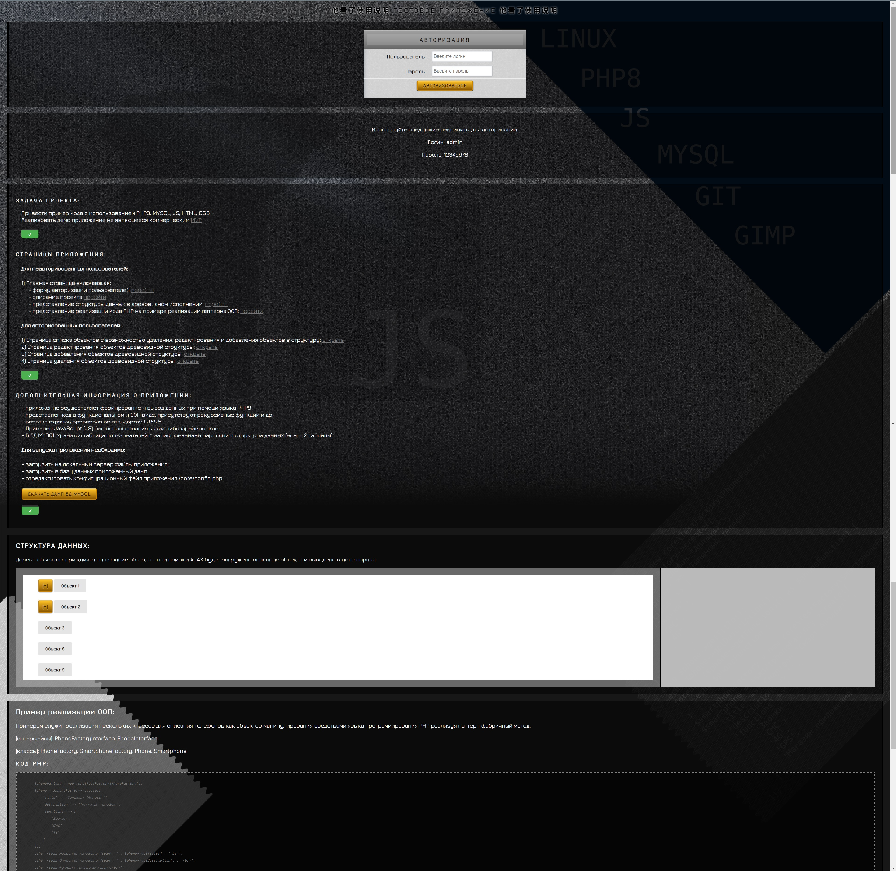

### DEMO APP ###
# Простое приложение на PHP #

## Для запуска тестового приложения на Linux:
 - установить LAMP [https://ru.wikipedia.org/wiki/LAMP],
 - скачать файлы приложения DEMO и положить в директорию проектов веб сервера (по умолчанию директория веб сервера Apache в Linux - /var/www)
 - проверить настройки в конфигурационном файле [/var/www]/core/config.php
 - настроить MYSQL (создать БД и пользователя как указано в конфигурационном файле)
 - создать в MYSQL базу данных и загрузить в неё файл дампа [/var/www]/db.zip

 ## Для запуска тестового приложения на Windows на примере Open Server:
 - установить Open Server
 - скачать файлы приложения DEMO в папку [папка установки Open Server]/domains/localhost/
 - проверить настройки в файле [папка установки Open Server]/domains/localhost/core/config.php
 - открыть phpMyAdmin, создать в нём пользователя, базу данных и загрузить в неё дамп [папка установки Open Server]/domains/localhost/db.zip
 - открыть в веб браузере http://localhost